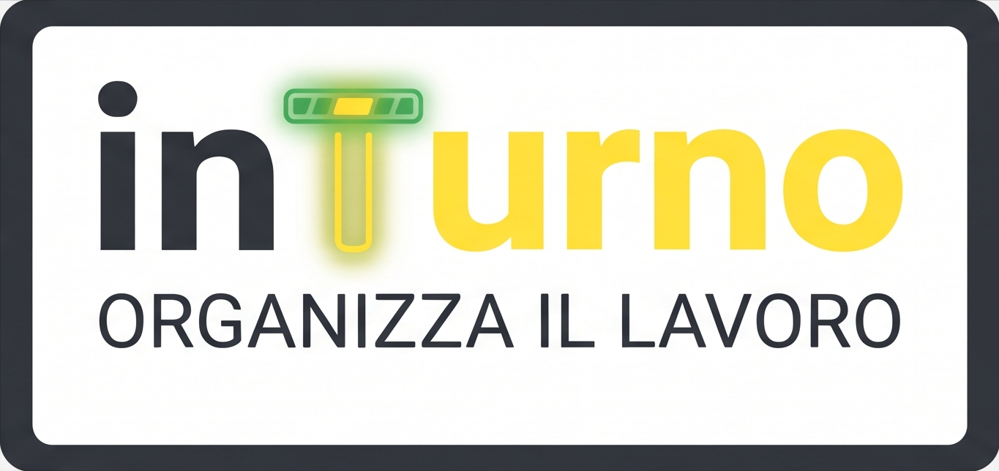

<div align="center">



<br/>
<br/>

**Progressive Web App (PWA) moderna, veloce ed elegante per la pianificazione, gestione e condivisione dei turni di lavoro.**

<br/>

[](https://relizard.github.io/inTurno/)

<br/>

[](https://react.dev/)
[](https://vitejs.dev/)
[](https://tailwindcss.com/)
[](https://web.dev/progressive-web-apps/)
[](LICENSE)

---

</div>

## 📖 Panoramica

**inTurno** è una Progressive Web App (PWA) progettata per lavoratori su turni (sanità, sicurezza, trasporti, industria, commercio). Consente di compilare, calcolare e condividere i propri turni con estrema semplicità, sia da smartphone (Android, iOS) che da computer.

L'applicazione funziona in modalità **offline-first**: tutti i dati e le pianificazioni restano memorizzati esclusivamente nel dispositivo dell'utente (`localStorage`), garantendo privacy assoluta e caricamento istantaneo senza bisogno di connessione internet continua.

---

## ✨ Funzionalità Principali

- 📅 **Calendario Mensile Interattivo**:
  - Assegnazione rapida tramite tocco singolo o "modalità pennello" continua.
  - Riconoscimento automatico delle **festività nazionali e solennità italiane** (inclusa Pasqua e Pasquetta con calcolo dell'algoritmo di Meeus).
  - Evidenziazione del giorno corrente e dei weekend.
  - Riassunto turni e ore lavorate sempre visibile.

- ⚡ **Generatore di Schemi Rapidi Alternati**:
  - Pianificazione ciclica e turnazioni a schema continuo (es. 2 Mattina - 2 Pomeriggio - 2 Notte - 2 Riposo, settimane alterne, ecc.).
  - Opzione rapida per compilare l'intera settimana lavorativa (Lun-Ven) con un solo tocco.

- 📤 **Suite Completa di Condivisione**:
  - **Sincronizzazione Calendario**: esportazione standard `.ics` compatibile con Google Calendar, Apple Calendario e Outlook.
  - **Invia Turni via WhatsApp**: compone un messaggio ordinato e preformattato pronto per familiari o colleghi.
  - **Foto Turni ad Alta Risoluzione**: generatore integrato di card grafiche (1080px) a colori con orari e totale ore, condivisibili come una foto dal rullino o salvabili nella galleria.
  - **Esportazione Excel (CSV)** e Stampa/PDF.

- 📊 **Report & Statistiche Dettagliate**:
  - Conteggio giorni lavorati, riposi, ferie, permessi e malattie.
  - Calcolo del monte ore complessivo con gestione di straordinari (`+1h`, `+2h`, ecc.).
  - Distribuzione percentuale per tipologia di turno.

- 🎨 **Interfaccia e Design**:
  - Tema **Light** con rilassante verde pastello naturale (`#eef7f2`).
  - Tema **Dark** notturno a contrasto bilanciato per la visione serale.
  - Layout completamente reattivo (ottimizzato per l'uso con una mano su smartphone).

---

## 🛠️ Stack Tecnologico

- **Frontend**: [React 18](https://react.dev/)
- **Bundler**: [Vite 5](https://vitejs.dev/)
- **Styling**: [Tailwind CSS 3.4](https://tailwindcss.com/)
- **Date Engine**: [date-fns](https://date-fns.org/)
- **Icone**: [Lucide React](https://lucide.dev/)
- **Grafica & Animazioni**: HTML5 Canvas 2D + [Canvas Confetti](https://www.npmjs.com/package/canvas-confetti)
- **CI/CD**: GitHub Actions (deploy automatico su GitHub Pages)

---

## 🚀 Sviluppo Locale

```bash
# Clona il repository
git clone git@github.com:ReLizard/inTurno.git
cd inTurno

# Installa le dipendenze
npm install

# Avvia il server di sviluppo con supporto HTTPS locale
npm run dev

# Compila la build di produzione
npm run build
```

---

## 📱 Installazione come PWA

1. Apri [https://relizard.github.io/inTurno/](https://relizard.github.io/inTurno/) dal browser del tuo smartphone (Chrome su Android o Safari su iPhone).
2. Tocca il menu delle opzioni (o il pulsante Condividi su Safari).
3. Seleziona **"Aggiungi a schermata Home"** o **"Installa app"**.
4. L'icona di inTurno comparirà insieme alle tue app, funzionante anche senza connessione internet.

---

## 📄 Licenza

Distribuito sotto licenza **MIT**. Consulta il file `LICENSE` per ulteriori dettagli.
